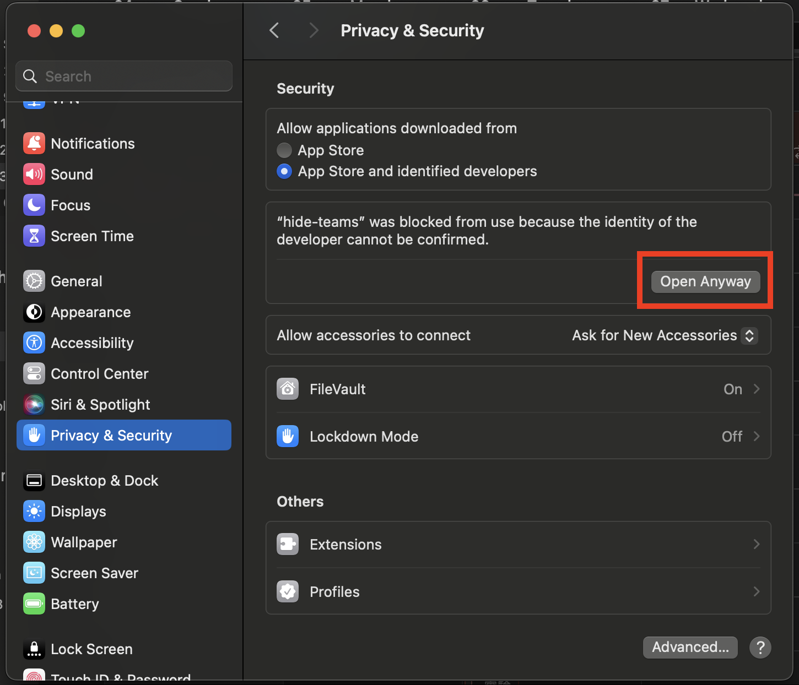

# Hide/Show Teams Overlay Tool

Are you too annoyed by the Microsoft Teams Overlay when screen sharing? This Python script toggles the visibility of Microsoft Teams-related windows on macOS! It's designed for users who want to hide overlay windows during screen sharing sessions in Microsoft Teams without closing the application.

## Features

- **Toggle Visibility**: With a single run, it detects Microsoft Teams processes and toggles the visibility of their windows.
- **Process Detection**: Dynamically identifies running processes related to Microsoft Teams and operates on them.
- **User Feedback**: Provides console feedback about the actions being performed, including the number of detected Teams-related processes and their visibility status.

## How to Use

1. Download the executable from the GitHub Releases.
2. Double-click to run. Each execution toggles the visibility of Microsoft Teams overlays.

### Running the Program for the First Time
When running the "hide-teams" executable for the first time on macOS, you may encounter a security warning stating, "hide-teams can't be opened because the identity of the developer cannot be confirmed." 


To bypass this, follow these steps:

1. Go to System Preferences > Security & Privacy.
2. Under the Security tab, you will see a message at the bottom saying "hide-teams was blocked from use because the identity of the developer cannot be confirmed."
3. Next to this message, click Open Anyway.
   
4. A confirmation dialog will appear. Click Open to allow the program to run.
   

**This process is a one-time security measure** by macOS for applications downloaded from the internet. After you've allowed it, you should be able to run the "hide-teams" executable without any further interruptions.

## Requirements

- macOS
- Python 3.x (for source code)

## Compiling the Executable Yourself

To compile this script into an executable for macOS:

1. Ensure Python and PyInstaller are installed.
2. Navigate to the script's directory in Terminal.
3. Run the following command to compile the executable for macOS:
   ```
   pyinstaller --onefile app.py
   ```
4. Find the executable in the `dist` folder.

This creates a standalone application that can be run without Python installed.

## Contributing

Contributions, issues, and feature requests are welcome!

## License

Distributed under the MIT License. See `LICENSE` for more information.

---

Ensure to provide clear setup instructions, including how to download Python if necessary and how to execute the script directly if users prefer that over using the executable.
